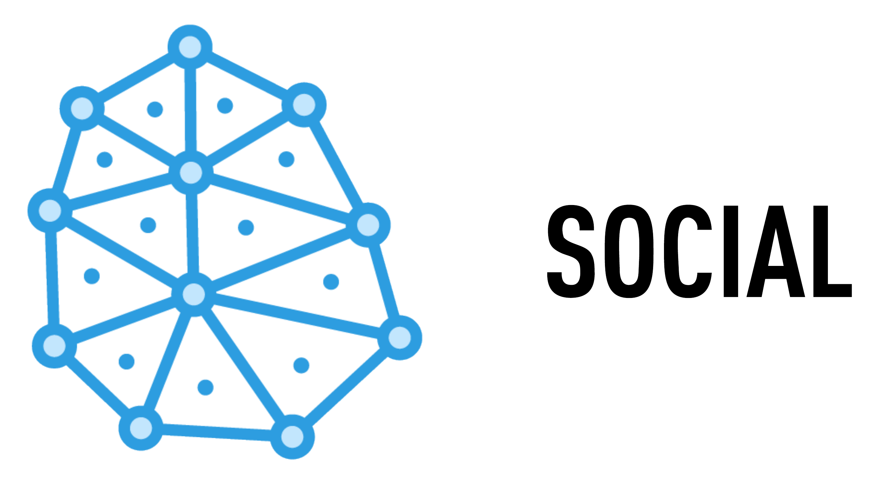

# Welcome

<a rel="license" href="http://creativecommons.org/licenses/by/4.0/"></a><br/>

Welcome to the Social Microservice. This repository is part of the [Drako](https://github.com/v8tix/drako) project.


## Getting Started

Social is based on the following technologies and standards:
  * Spring Boot 2.1.x.RELEASE
    * [Reactor](https://projectreactor.io/)
    * [Reactive Spring Data (MongoDB)](https://docs.spring.io/spring-data/mongodb/docs/current/reference/html/#mongo.reactive)
    * [Spring WebFlux](https://docs.spring.io/spring/docs/current/spring-framework-reference/web-reactive.html)
  * [Bean Validation 2.0 (JSR 380)](http://hibernate.org/validator/releases/6.0/)
  * [Web Linking (RFC 5988)](https://tools.ietf.org/html/rfc5988)
  * [Cross-Origin Resource Sharing (CORS)](https://www.w3.org/TR/cors/)
  
### Prerequisites
  * MongoDB 3.6 or higher.
  * Java SE 8u212 or higher.
  * Apache Maven 3.6.0 or higher.

### What this guide covers

1. The project profiles. 
2. The dev profile. 
3. Running the application in dev mode.
4. Externalized configuration. 
5. Running the application in prod mode.

### 1. The project profiles.
* You can define three kinds of profiles:
  * Default (application-default.yml).
  * Development (application-dev.yml).
  * Production (application-prod.yml).
* :speech_balloon: For security reasons, the production profile must be activated using Spring's external configuration.
* The application-default.yml file allows us to switch between the other two profiles, and it keeps the common configuration. 
* Links of interest:
  * [Activating Spring Boot profile with Maven profile](http://dolszewski.com/spring/spring-boot-properties-per-maven-profile/). 
  * [Spring Profiles](https://www.baeldung.com/spring-profiles). 
### 2. The dev profile.
* The dev profile needs a local MongoDB instance. If you plan to use another instance like [MongoDB Atlas](https://www.mongodb.com/cloud/atlas), you can edit the following property in the application-dev.yml file:
  ````
  spring:
  ...
    data:
      mongodb:
        uri: <mongodb_uri>
  ````
* This profile assumes that your are working on your localhost. The following properties describe this configuration:
  ````
  rest:
    host: localhost:${server.port}
    ...
    dns: ${rest.host}
  ````
* Also the logging level and path configurations can be found under the logging property :
  ````
  logging:
    file: /var/log/social.log
    level: 
      ...
  ```` 
### 3. Running the application in dev mode.
* :speech_balloon: Running in dev mode, the MongoDB instance will be populated with sample data (See the InitDatabase component).
* First, you need to package the app using the dev profile:
  ````
  $ mvn clean package -Pdev
  ````
* If you want to skip the tests, run instead:
  ````
  $ mvn clean package -Pdev -DskipTests=true
  ````  
* Then, execute:
  ````
  $ sudo java -jar target/social-1.0.0.v20200309.jar
  ````
* :speech_balloon: By executing as sudo, the microservice can create the log file under the /var/log/ directory. 
### 4. Externalized configuration.
* Sometimes you need to externalize your configuration (for security reasons).
* Make a copy of the application-default.yml and application-dev.yml files to a directory of your choice. For example, /home/v8tix/microservices/social/config/.
* Rename the application-dev.yml file to application-prod.yml.
* Find the value @activatedProperties@ in the application-default.yml file, and replace it by prod.
* Find the MongoDB URI connection in the application-prod.yml file, and replace it by your production URI.
* Links of interest: [Externalized Configuration](https://docs.spring.io/spring-boot/docs/current/reference/html/boot-features-external-config.html).

### 5. Running the application in prod mode.
* :speech_balloon: Running in prod mode, the MongoDB instance will not be populated with sample data.
* Package the application (Go to step 3). 
* Then, execute:
  ````
  $ sudo java -jar target/social-1.0.0.v20200309.jar --spring.config.location=file:///home/v8tix/microservices/social/config/
  ````    
* :speech_balloon: By executing as sudo, the microservice can create the log file under the /var/log/ directory.
## Authors
* Initial work
  * V8TIX - info@v8tix.com   
## License  
<a rel="license" href="http://creativecommons.org/licenses/by/4.0/">&nbsp;</a>This work is licensed under a [Creative Commons Attribution 4.0 International License](http://creativecommons.org/licenses/by/4.0/).  
